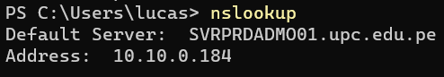

---
tags:
  - arquitecture
---
# Enterprise Service Bus (ESB)

Un patron de arquitectura donde un software realiza una integración entre dos aplicaciones.
Tiene función de una cola.

Servicios:
- Active MQ
- Rabbit MQ
- Kafka

## Principales Capacidades de un ESB

- Adaptadores de protocolos
- Middleware orientado a mensajes
- Mensajería basada en xml
- Transformación de mensajes
- Calidad del servicio
- Monitoreo y administración
- API extendible
- Trabaja con protocolos
## Como funciona

Conecta las aplicaciones usando un cal de mensaje, donde una aplicación escribe informacion en el canal y la otra lee esa información del canal. 

## Base de datos federadas
Son bases de datos descentralizadas, por ejemplo los DNS

---
## Notas Extra

- Bases de datos no estan diseñadas para poder aguantar muchos requests, transacciones
- Aplicaciones estan programadas para dejar y leer mensajes, selects, inserts, deletes, directo a la base de datos, pero al usar un ESB, se tiene que cambiar esa forma de manejar datos.
- Middleware es un termino general, puede ser base de datos, servidor de aplicaciones... 
- Broker y bus son lo mismo. Broker es un elemento de arquitectura. Broker se menciona mas en el internet, y el enterprise service bus mas en una organización.
- Apache Kafka, es la voz.

Ver el DNS de tu IP:
```powershell
nslookup
```
Resultado:

