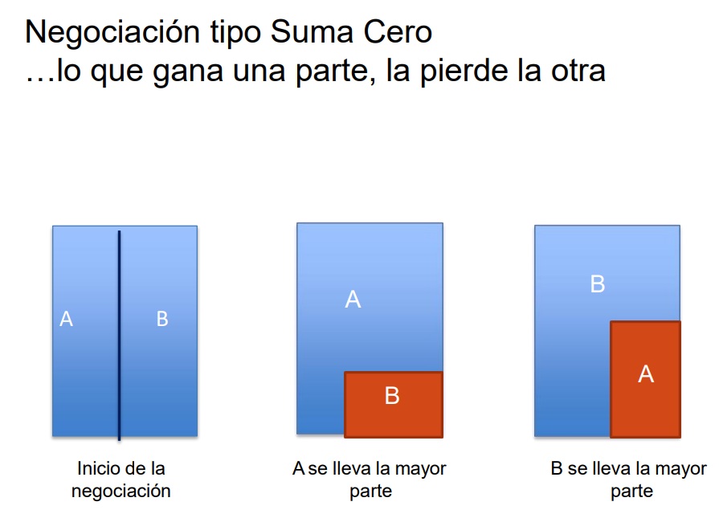

Definición: negociación en la que el beneficio para una parte se traduce en la perdida de otro

Resultados:
- Escenario positivo: acuerdo realizado
- Escenario negativo: no alcanzar un acuerdo
- Escenario alternativo: tener una mejor Alternativa a un Acuerdo Negociado (MAAN)
  MAAN es una alternativa que debo llevar antes de una negociación, como tu as bajo la manga

ZOPA: zona de posible acuerdo, es una punto en el que ambos lados negociaran

Como conocer el punto de resistencia, lo mínimo o máximo que pagaran:
	Manejar la información que queremos que la otra parte tenga de nosotros
	Contar con información abundante de la otra parte
	Obtener la confianza de la otra parte

Actividad (subir al BB):
La estrategia con la que se inicia y la estrategia con la que se termina.
Soy Javier.
- Renta $200 c/u
- Yo realizo el pago, no recibo ninguna apreciación por el esfuerzo
- Pago los gastos en gasolina y otros también
- Mariana esta tomando demasiado tiempo para realizar su parte del pago, al final decidí pagar solo mi parte (antes del vencimiento)
- Le ponen una multa por mora de $10, Mariana insiste que también debo pagarla
- Me levanta media noche para hablar del tema, y después de quejarse se pone a hablar en el teléfono sin dejarme dormir
- Tuve una semana muy pesada con muchos exámenes parciales, otro que iba a ser mañana, y una entrevista de trabajo la próxima semana

Mi estrategia:
Hacerla entender:
- Recordar que siempre soy el que realiza el pago, no solo de la renta sino también de la gasolina y otros, y siento una falta de apreciación.
- Estoy en una semana de parciales, mañana tengo un examen y la próxima semana tengo una entrevista, y tu estas aquí levantándome a discutir esto a las 12 de la noche. 
Negociar:
Mis objetivos...
- Hacer que ella pague la multa: yo estuve intentando contactarla para que de su parte también, no es responsabilidad mía entregar la parte que le corresponde a ella
- A partir de ahora no quiero entregar su parte.
	- Podemos turnar quien realiza la entrega de dinero, especificar donde dejar el dinero, y si no esta allí se entrega solo una parte, el otro se hace cargo de cualquier cargo adicional que recaiga sobre la acción.
	- Hablar con los propietarios para ver la posibilidad de realizar el pago por separado.
- No interrumpir mis horas personales, dejarme dormir.

Como termino la negociación...
- Para la multa, Javier paga 30 y Mariana paga 50
- Tengo que ser mas limpio
- Respetar mis horas para dormir
- Para el caso de la renta, guardaremos el dinero en una caja fuerte, donde intercalaremos quien realiza el pago. Adicionalmente, se guardara también la paga del siguiente mes, en caso de emergencia para no estar buscando el otro a ultimas horas.